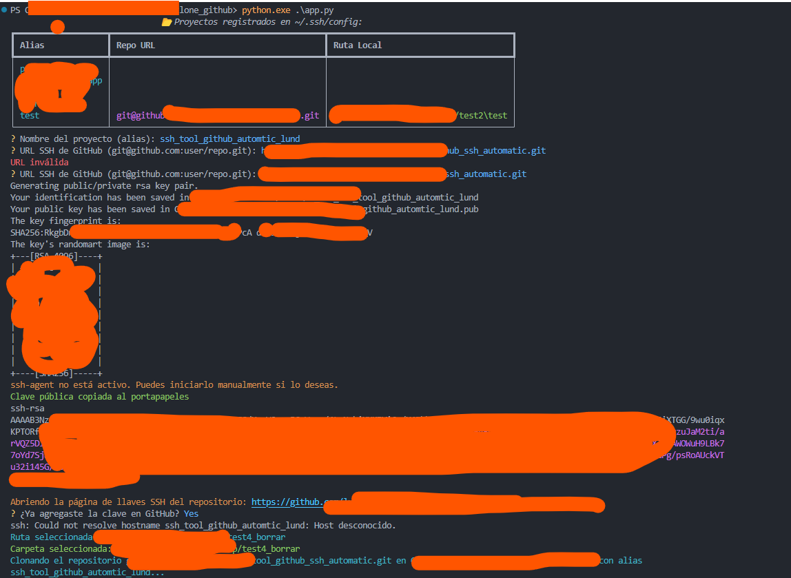
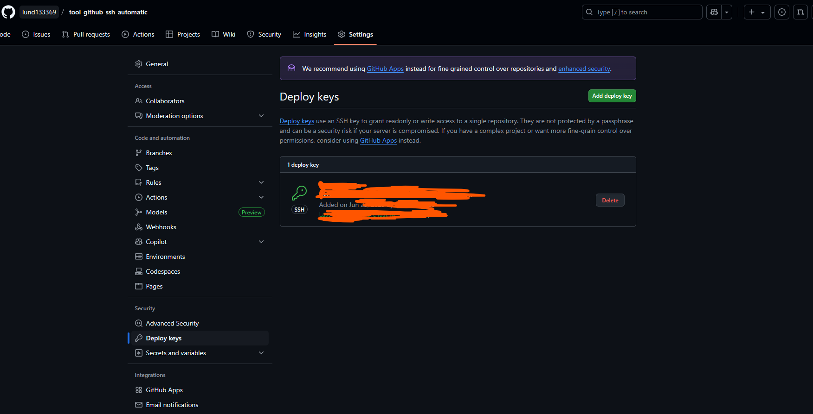

# 🚀 GitHub Auto Cloner for SSH (ID_RSA) / Clonador Automático de GitHub por SSH (ID_RSA)  

<p align="center">
  
</p>


> **CLI interactivo para clonar repositorios de GitHub vía SSH, gestionando claves y configuración automáticamente, con interfaz amigable y selección de carpeta por GUI.**

> ⚠️ **Actualmente solo disponible para Windows.**
> 
> 🟦 **Se recomienda ejecutar desde PowerShell y usar:**
> ```powershell
> python.exe app.py
> ```

---

## 📑 Tabla de Contenidos

- [✨ Características](#características)
- [⚡ Instalación](#instalación)
- [🔧 Requisitos](#requisitos)
- [🚦 Uso Rápido](#uso-rápido)
- [🖥️ Ejemplo de Flujo](#ejemplo-de-flujo)
- [💡 Notas y Consejos](#notas-y-consejos)
- [📂 Estructura del Proyecto](#estructura-del-proyecto)
- [⏳ Pendientes](#pendientes)

---

## ✨ Características

- 🎨 Interfaz CLI colorida con [rich](https://github.com/Textualize/rich) y [InquirerPy](https://github.com/kazhala/InquirerPy)
- 🔑 Generación y gestión automática de claves SSH por alias
- 🗂️ Selección de carpeta destino con GUI (Tkinter)
- 🤖 Automatización de configuración en `~/.ssh/config`
- 📋 Copia la clave pública al portapapeles
- 🌐 Abre la página de llaves SSH en GitHub automáticamente
- 🛡️ Prueba la conexión SSH antes de clonar
- 🧩 Compatible con Windows, Linux y macOS

---

## ⚡ Instalación

```bash
# Clona este repositorio o descarga los archivos
# Luego instala las dependencias:
pip install -r requirements.txt
```

---

## 🔧 Requisitos

- Python 3.8+
- Git
- OpenSSH
- Tkinter (incluido en la mayoría de instalaciones de Python)

---

## 🚦 Uso Rápido

```bash
python app.py
```

---

## 🖥️ Ejemplo de Flujo

<p align="center">
  
</p>
1. Muestra proyectos registrados en `~/.ssh/config`
2. Permite crear un nuevo alias/proyecto
3. Genera clave SSH y actualiza `~/.ssh/config`
4. Agrega clave al ssh-agent
5. Copia clave pública al portapapeles
6. Abre la página de llaves SSH en GitHub y espera confirmación
7. Prueba conexión SSH
8. Solicita URL de GitHub
9. Selecciona carpeta de destino (GUI)
10. Clona el repositorio usando el alias
11. Abre la carpeta clonada
12. Pregunta si deseas clonar otro proyecto

---

## 💡 Notas y Consejos

- 🔒 **Nunca compartas tus claves privadas (`id_rsa_*`)**
- 🟢 El script es seguro: solo agrega claves y hosts bajo tu control
- 🪟 En Windows, asegúrate de tener Git y OpenSSH en el PATH
- 🐧 En Linux/macOS, asegúrate de tener permisos para modificar `~/.ssh/config`

---

## 📂 Estructura del Proyecto

```
├── app.py                # Script principal CLI
├── select_folder_tk.py   # Script auxiliar para selección de carpeta (Tkinter)
├── requirements.txt      # Dependencias Python
├── .gitignore            # Exclusiones de git
└── README.md             # Este archivo
```

---

## ⏳ Pendientes

- [ ] FALTA VERSION PARA LINUX
- [ ] FALTA VERSION PARA LINUX SERVER (SIN BROWSER)
- [ ] FALTA QUE LUEGO DE CLONAR EL REPOSITORIO, ENTRAR A LA CARPETA Y CORREGIR EL SSH URL REMOTE ORIGIN

---

<p align="center">
  <b>¡Contribuciones y sugerencias son bienvenidas! ⭐</b>
</p>
